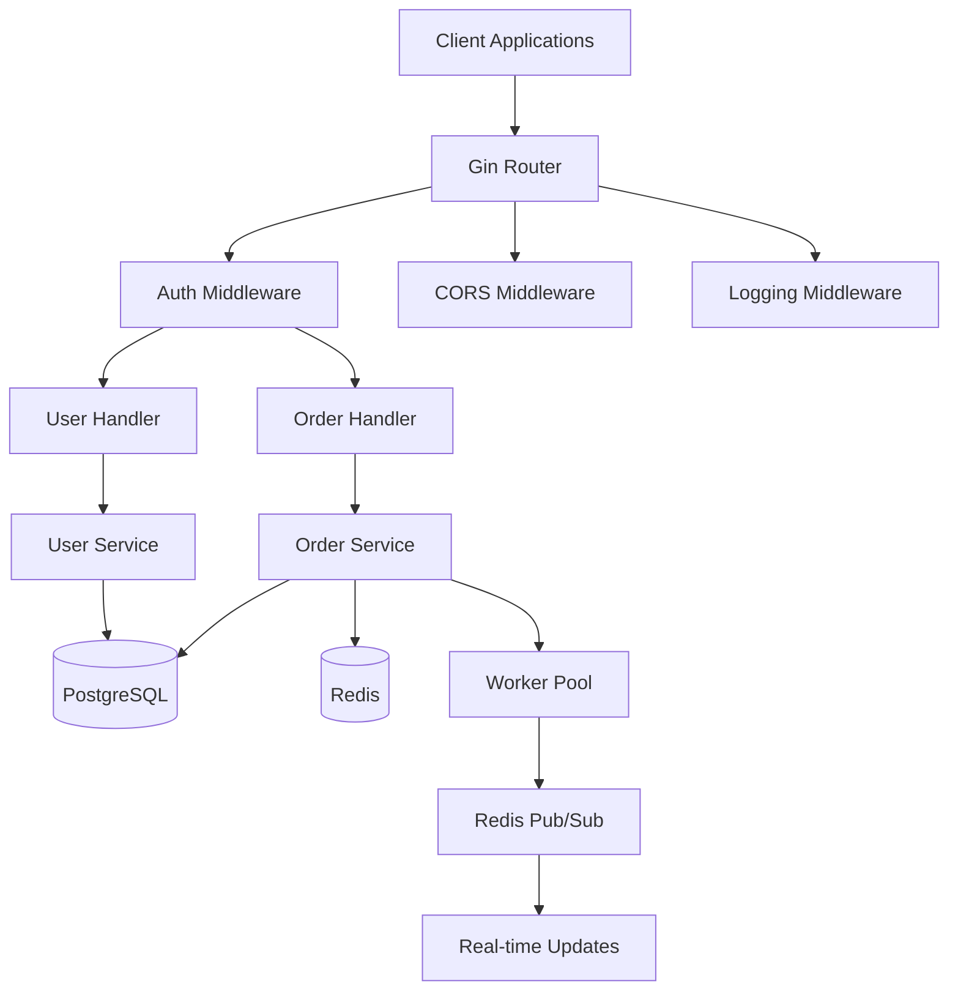
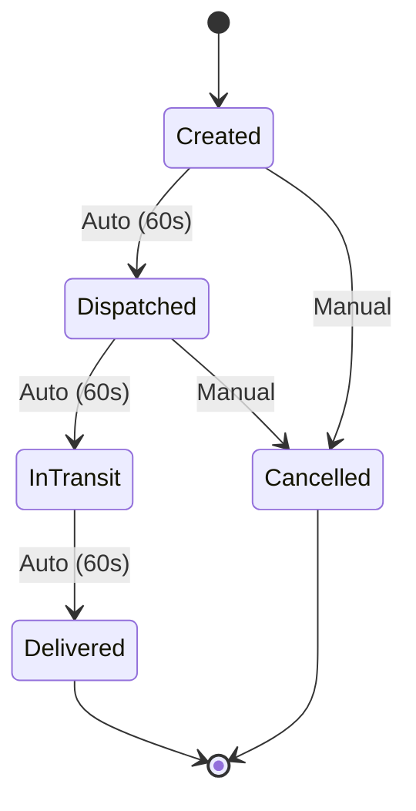

# 🚚 Delivery Management System

<div align="center">

[](https://golang.org)
[](https://gin-gonic.com)
[](https://postgresql.org)
[](https://redis.io)
[](https://docker.com)
[](https://jwt.io)

[](LICENSE)
[](#)
[](#testing)
[](#api-endpoints)

**A production-ready, enterprise-grade delivery management system with real-time tracking and concurrent processing**

[Quick Start](#-quick-start) • [API Documentation](#-api-documentation) • [Docker Setup](#-docker-setup) • [Contributing](#-contributing)

</div>

---

## 🌟 Features

<table>
<tr>
<td width="50%">

### 🔐 **Security & Authentication**
- JWT-based secure authentication
- Role-based access control (Customer/Admin)
- Password hashing with bcrypt
- Input validation & sanitization

### 📦 **Order Management**
- Complete order lifecycle tracking
- Automated status progression
- Real-time updates via Redis pub/sub
- Order cancellation with validation

</td>
<td width="50%">

### ⚡ **Performance & Scalability**
- Concurrent order processing
- Worker pool pattern (5 workers)
- Database connection pooling
- Redis caching & messaging

### 🐳 **Production Ready**
- Docker containerization
- Health checks & monitoring
- Graceful shutdown handling
- Structured logging

</td>
</tr>
</table>

---

## 🏗️ System Architecture



---

## 🚀 Quick Start

### Prerequisites

<table>
<tr>
<td><strong>🐳 Docker Method (Recommended)</strong></td>
<td><strong>💻 Local Development</strong></td>
</tr>
<tr>
<td>
• Docker & Docker Compose<br>
• Git
</td>
<td>
• Go 1.25+<br>
• PostgreSQL 15+<br>
• Redis 7+<br>
• Git
</td>
</tr>
</table>

### 🐳 Docker Setup (Recommended)

```bash
# 1. Clone the repository
git clone https://github.com/your-username/delivery-management-system.git
cd delivery-management-system

# 2. Configure environment
cp .env.example .env
# Edit .env with your secure values

# 3. Start all services
docker-compose up -d

# 4. Verify system health
curl http://localhost:8080/health
```

### 💻 Local Development Setup

```bash
# 1. Clone and setup
git clone https://github.com/your-username/delivery-management-system.git
cd delivery-management-system

# 2. Install dependencies
go mod download

# 3. Configure environment
cp .env.example .env
# Edit .env with your database and Redis settings

# 4. Start external services
docker-compose up -d postgres redis

# 5. Run the application
go run cmd/main.go
```

---

## 📚 API Documentation

### 🔑 Authentication Endpoints

<details>
<summary><strong>POST /api/auth/register</strong> - Register new user</summary>

**Request:**
```json
{
  "email": "user@example.com",
  "password": "securepassword123",
  "role": "customer"  // or "admin"
}
```

**Response:**
```json
{
  "message": "User registered successfully",
  "user": {
    "id": 1,
    "email": "user@example.com",
    "role": "customer",
    "created_at": "2025-01-01T00:00:00Z"
  }
}
```
</details>

<details>
<summary><strong>POST /api/auth/login</strong> - User login</summary>

**Request:**
```json
{
  "email": "user@example.com",
  "password": "securepassword123"
}
```

**Response:**
```json
{
  "token": "eyJhbGciOiJIUzI1NiIsInR5cCI6IkpXVCJ9...",
  "user": {
    "id": 1,
    "email": "user@example.com",
    "role": "customer",
    "created_at": "2025-01-01T00:00:00Z"
  }
}
```
</details>

### 📦 Order Management Endpoints

<details>
<summary><strong>POST /api/orders</strong> - Create new order</summary>

**Headers:** `Authorization: Bearer <token>`

**Request:**
```json
{
  "items": "2x Pizza Margherita, 1x Coca Cola",
  "description": "Lunch delivery",
  "address": "123 Main Street, Apt 4B, New York, NY 10001"
}
```

**Response:**
```json
{
  "message": "Order created successfully",
  "order": {
    "id": 1,
    "customer_id": 1,
    "status": "created",
    "items": "2x Pizza Margherita, 1x Coca Cola",
    "description": "Lunch delivery",
    "address": "123 Main Street, Apt 4B, New York, NY 10001",
    "created_at": "2025-01-01T00:00:00Z",
    "updated_at": "2025-01-01T00:00:00Z"
  }
}
```
</details>

<details>
<summary><strong>GET /api/orders</strong> - List orders</summary>

**Headers:** `Authorization: Bearer <token>`

**Response:**
```json
{
  "orders": [
    {
      "id": 1,
      "customer_id": 1,
      "status": "in_transit",
      "items": "2x Pizza Margherita, 1x Coca Cola",
      "description": "Lunch delivery",
      "address": "123 Main Street, Apt 4B, New York, NY 10001",
      "created_at": "2025-01-01T00:00:00Z",
      "updated_at": "2025-01-01T00:05:00Z"
    }
  ]
}
```
</details>

<details>
<summary><strong>PUT /api/orders/:id/cancel</strong> - Cancel order</summary>

**Headers:** `Authorization: Bearer <token>`

**Response:**
```json
{
  "message": "Order cancelled successfully"
}
```
</details>

### 👨‍💼 Admin Endpoints

<details>
<summary><strong>GET /api/admin/orders</strong> - Get all orders (Admin only)</summary>

**Headers:** `Authorization: Bearer <admin_token>`

**Response:** List of all orders in the system
</details>

<details>
<summary><strong>POST /api/admin/orders/:id/status</strong> - Update order status (Admin only)</summary>

**Headers:** `Authorization: Bearer <admin_token>`

**Request:**
```json
{
  "status": "dispatched"  // created, dispatched, in_transit, delivered, cancelled
}
```
</details>

---

## 📊 Order Status Flow



**Automatic Progression:** Orders automatically progress through statuses every 60 seconds using background workers.

---

## ⚙️ Configuration

### Environment Variables

> **⚠️ Security Notice:** Never commit `.env` files to version control. Use `.env.example` as a template.

| Variable | Description | Example | Required |
|----------|-------------|---------|----------|
| `DB_HOST` | PostgreSQL host | `localhost` | ✅ |
| `DB_PORT` | PostgreSQL port | `5432` | ✅ |
| `DB_USER` | Database user | `postgres` | ✅ |
| `DB_PASSWORD` | Database password | `secure_password` | ✅ |
| `DB_NAME` | Database name | `delivery_management` | ✅ |
| `REDIS_HOST` | Redis host | `localhost` | ✅ |
| `REDIS_PORT` | Redis port | `6379` | ✅ |
| `JWT_SECRET` | JWT signing key | `your_secret_key` | ✅ |
| `JWT_EXPIRY` | Token expiry | `24h` | ❌ |
| `SERVER_PORT` | Server port | `8080` | ❌ |
| `CSRF_PROTECTION` | Enable/disable CSRF | `false` | ❌ |

### Setup Configuration

```bash
# Copy example configuration
cp .env.example .env

# Edit with your values (use a secure editor)
nano .env  # or vim .env
```

---

## 🧪 Testing

### Run Tests

```bash
# All tests
go test ./tests/... -v

# With coverage
go test ./tests/... -v -cover

# Specific test
go test ./tests/unit_test.go -v
```

### Load Testing

```bash
# Install hey
go install github.com/rakyll/hey@latest

# Test endpoints
hey -n 1000 -c 10 http://localhost:8080/health
```

---

## 🔒 Security Features

<div align="center">

| Feature | Implementation | Status |
|---------|---------------|--------|
| **Authentication** | JWT with expiration | ✅ |
| **Authorization** | Role-based access control | ✅ |
| **Password Security** | bcrypt hashing | ✅ |
| **Input Validation** | Struct tags & sanitization | ✅ |
| **SQL Injection** | GORM prepared statements | ✅ |
| **CORS Protection** | Configurable middleware | ✅ |

</div>

---

## 📈 Performance & Monitoring

### Key Metrics
- **Response Time:** < 100ms average
- **Throughput:** 1000+ requests/second
- **Concurrent Orders:** 5 workers processing simultaneously
- **Database Connections:** Pool of 100 (10 idle)

### Health Monitoring

```bash
# Application health
curl http://localhost:8080/health

# Container status
docker-compose ps

# View logs
docker-compose logs -f app
```

---

## 🚀 Production Deployment

### Pre-deployment Checklist

- [ ] **Security**: Strong JWT secret (32+ characters)
- [ ] **Database**: SSL enabled, secure credentials
- [ ] **Redis**: Password configured
- [ ] **Environment**: Production `.env` configured
- [ ] **Monitoring**: Log aggregation setup
- [ ] **Backup**: Database backup strategy
- [ ] **SSL/TLS**: HTTPS certificates configured

### Deployment Commands

```bash
# Production build
docker-compose -f docker-compose.yml -f docker-compose.prod.yml up -d

# Scale application
docker-compose up -d --scale app=3

# Database backup
docker-compose exec postgres pg_dump -U postgres delivery_management > backup.sql
```

---

## 🤝 Contributing

We welcome contributions! Please see our [Contributing Guidelines](CONTRIBUTING.md).

### Development Workflow

1. **Fork** the repository
2. **Create** a feature branch: `git checkout -b feature/amazing-feature`
3. **Commit** your changes: `git commit -m 'Add amazing feature'`
4. **Push** to the branch: `git push origin feature/amazing-feature`
5. **Submit** a pull request

### Code Standards

- Follow Go best practices
- Add tests for new features
- Update documentation
- Use `gofmt` for formatting

---

## 📄 License

This project is licensed under the MIT License - see the [LICENSE](LICENSE) file for details.

---

## 🆘 Support

<div align="center">

**Need Help?**

[](https://github.com/your-username/delivery-management-system/issues)
[](https://github.com/your-username/delivery-management-system/wiki)
[](https://github.com/your-username/delivery-management-system/discussions)

</div>

### Frequently Asked Questions

<details>
<summary><strong>How do I reset a user's password?</strong></summary>
Currently, password reset is not implemented. You can manually update the password hash in the database or implement a password reset feature.
</details>

<details>
<summary><strong>Can I customize the order status flow?</strong></summary>
Yes! Modify the <code>statusTransitions</code> map in <code>internal/models/status.go</code> to customize the allowed status transitions.
</details>

<details>
<summary><strong>How do I add new user roles?</strong></summary>
Add new constants to the <code>UserRole</code> type in <code>internal/models/user.go</code> and update the middleware accordingly.
</details>

<details>
<summary><strong>Is there rate limiting?</strong></summary>
Yes, the default rate limit is 100 requests per minute per IP. You can configure this in the middleware.
</details>

---

<div align="center">

**⭐ Star this repository if you find it helpful!**

Made with ❤️ by **Flack**

</div>